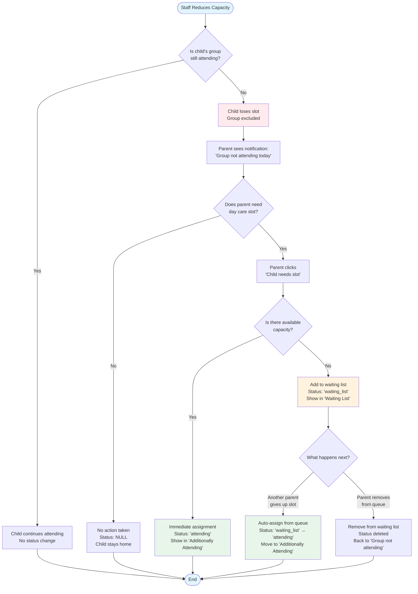
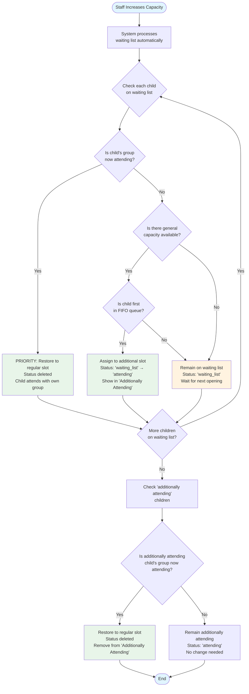
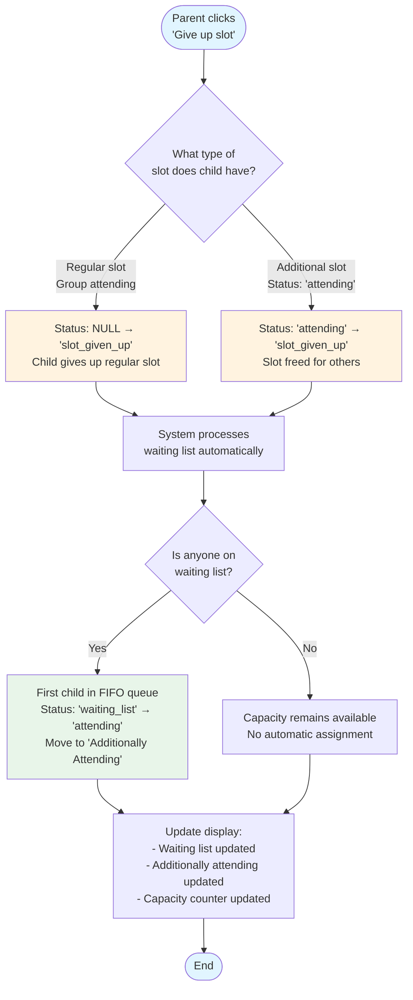
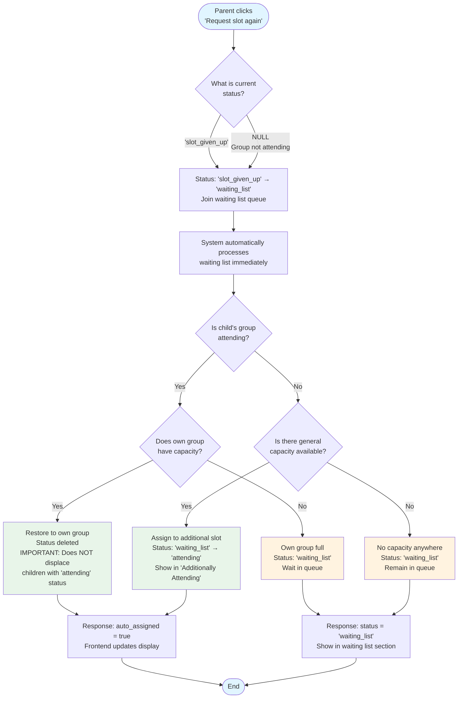
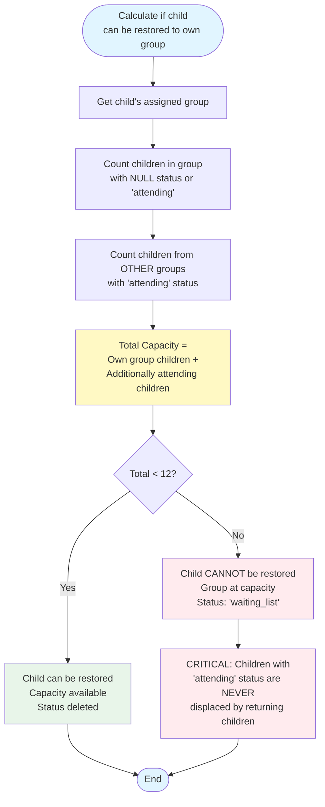
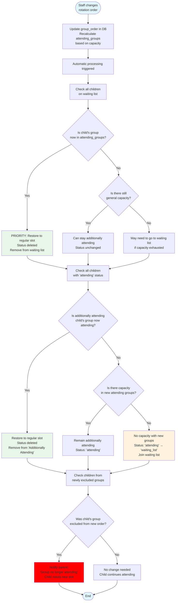
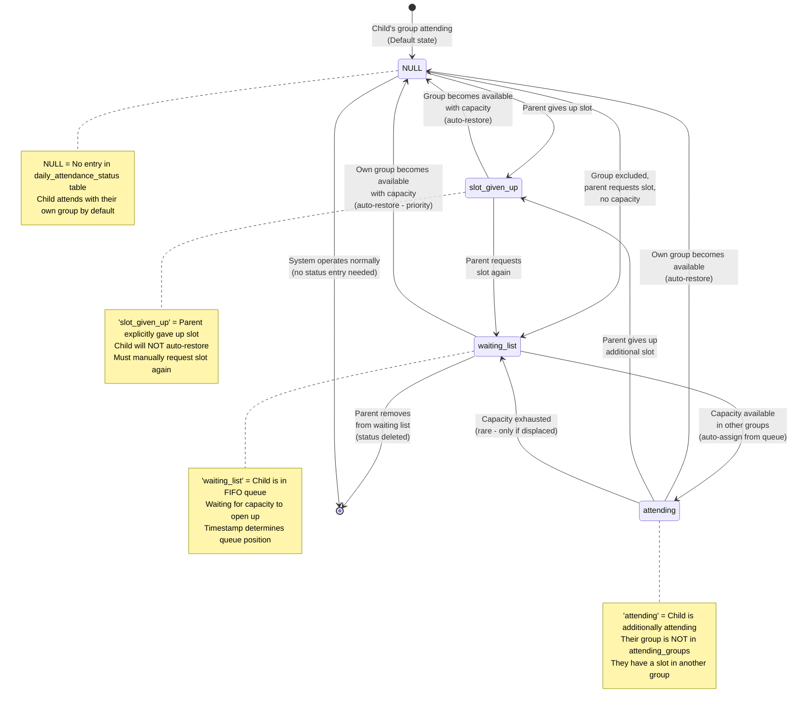
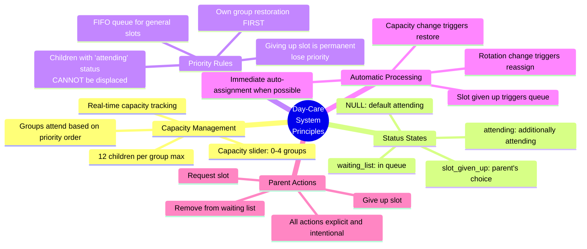

# Day-Care System User Flows - Visual Diagrams

This document provides graphical representations of the main user flows in the day-care rotation system.

## Flow 1: Capacity Reduction - Child Loses Slot

## Flow 2: Capacity Increase - Automatic Reassignment

## Flow 3: Parent Gives Up Slot

## Flow 4: Parent Re-Requests Slot After Giving Up

## Flow 5: Capacity Calculation Logic

## Flow 6: Staff Changes Rotation Order

## Status State Diagram

## Key Principles Summary

---

## Notes

- **Green boxes** indicate successful slot assignment
- **Orange/Yellow boxes** indicate waiting or pending states
- **Red boxes** indicate slot loss or capacity issues
- **Blue boxes** indicate start/end points
- All flows are triggered either by **staff actions** (capacity/rotation changes) or **parent actions** (request/give up slot)
- The system is **reactive** - it processes automatically when triggered, but doesn't change state without a trigger
